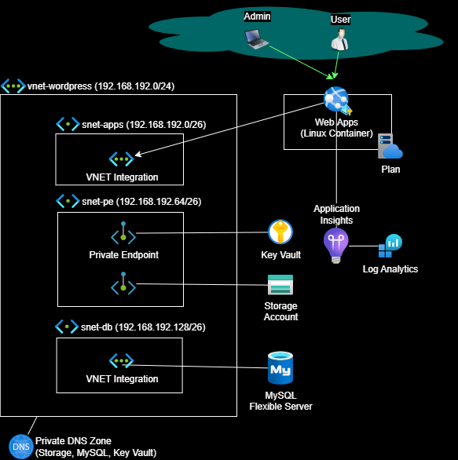
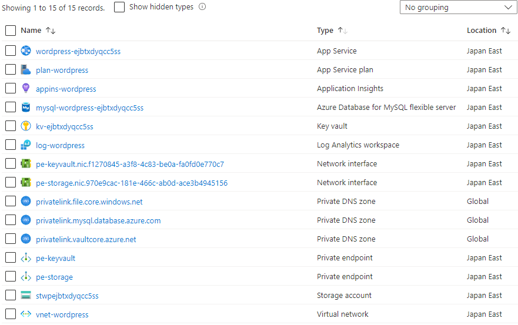
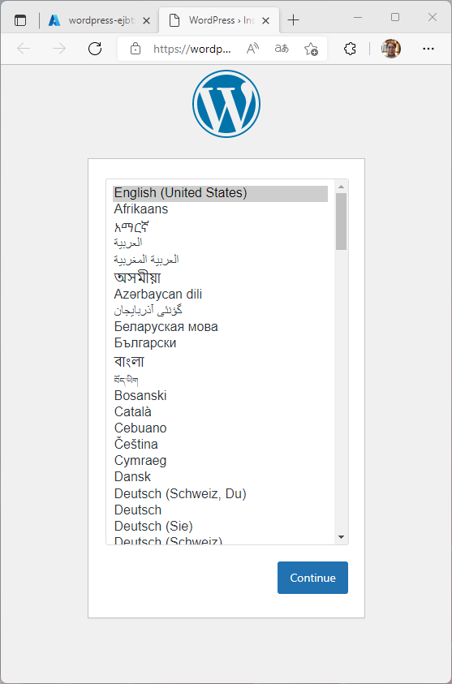
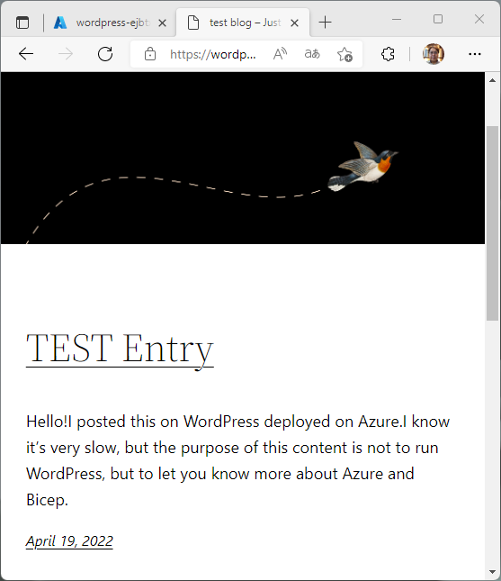

# 低価格、高セキュリティのWordPress環境をAzureでデプロイ

**Select a language: \[[English](./README.md)\] \[[日本語](./README-ja.md)\]**

## 特徴

- Bicepによる一発デプロイ
- ほぼ全てのPaaSへのアクセスをVirtual Network経由にすることで高いセキュリティを担保
- 秘匿情報はKey Vaultに保持。アプリケーションからはKey Vault Reference(無論閉域)にて安全にアクセス
- WordPressのコンテナイメージは公式ベース
- 永続化領域はMySQLとStorageに保存



## 使い方

az login済みでターゲットサブスクリプションが選択済みの状態にする

```sh
az login --tenant your_tenant_name_or_id
az account set --subscription your_subscription_name_or_id
```

deploy.sh の LOCATION, RESOURCE_GROUP, ADMIN_PASS の値を適宜修正する。

```sh
LOCATION=japaneast
RESOURCE_GROUP=rg-azure-wordpress
ADMIN_PASS='P@ssword'
```

deploy.sh を実行すると、リソースグループが作成され、その配下に必要なリソースが作成される。

Database for MySQL Flexible Serverのデプロイには30分程度はかかるため、のんびり待つ。

```sh
$ ./deploy.sh 
+ LOCATION=japaneast
+ RESOURCE_GROUP=rg-azure-wordpress
+ date +deploy-%d%H%M%S
+ DEPLOY_NAME=deploy-19094617
+ ADMIN_PASS=P@ssword
+ az group create --location japaneast --resource-group rg-azure-wordpress
{
  "id": "/subscriptions/..../resourceGroups/rg-azure-wordpress",
  "location": "japaneast",
  "managedBy": null,
  "name": "rg-azure-wordpress",
  "properties": {
    "provisioningState": "Succeeded"
  },
  "tags": null,
  "type": "Microsoft.Resources/resourceGroups"
}
+ az deployment group create --name deploy-19094617 --resource-group rg-azure-wordpress --template-file ./deploy.bicep --parameters adminPass=P@ssword cheapLevel=1
 - Running ..
```

デプロイ完了後、コマンドプロンプトが戻ってきたら Azure Portalから様子を見てみると、無事にリソースが色々作成されている。



wordpress-xxxxx (App Service)を開き、URLを確認してブラウザから開く。

初回起動では、Docker Containerのpullに時間がかかるので、表示までに時間がかかる。

もし、DB接続が失敗したりブラウザがタイムアウトした場合には、ブラウザのリロードを行うか、Web AppsのRestartを行うと改善する場合がある。

無事WordPressの初期インストール画面が表示されたら、後は実際に使うだけ。



とても動作は遅いけど、ちゃんと動いていることが確認できた。



## Bicepコードについて

- 決して素晴らしいコードではありません
- サンプル目的のため、手を抜いている箇所もあります(Virtual NetworkのSubnet IDの参照など)
- それでも、[Best practices for Bicep](https://docs.microsoft.com/en-us/azure/azure-resource-manager/bicep/best-practices) に沿って作成しました
- Private Endpointの実装や、Key VaultをWeb Appsから利用する部分などは参考になると思います
- Best practicesのページにも書かれているが、dependsOn の使用は決して悪ではない。理由のある最低限必要な依存関係のみ記述しました

## WordPressコンテナイメージについて

[WordPress Official Image](https://hub.docker.com/_/wordpress) にあるものをそのまま使いたかったのですが、/etc/apache2/apache2.conf がそのままでは都合が悪かったので設定を追加したcontainer image (katakura/wordpress:latest) を使っています。

中身は本リポジトリの wordpress/ に Dockerfile があります。

```Dockerfile
FROM wordpress:latest

RUN echo "EnableMMAP Off" >> /etc/apache2/apache2.conf

RUN echo "EnableSendfile Off" >> /etc/apache2/apache2.conf

EXPOSE 80

CMD ["apache2-foreground"]
```

これは、Stack overflowの [Wordpress in Containers - getting 502 when loading some images](https://stackoverflow.com/questions/65021932/wordpress-in-containers-getting-502-when-loading-some-images) と同じ問題が発生したため、中に書かれている回答を参考にして対応を行いました。

## Azure料金について

2022年4月にApp Service Basic SKUでもVNET Integration, Private EndpointがGAとなったため、安価な構成が組めました。

[Generally available: Enhanced network security features for App Service Basic SKU](https://azure.github.io/AppService/2022/04/14/Enhanced-security-for-basic-sku.html)

ざっくりですが、ネットワーク転送量を考慮しない場合で $25/month (3,000円/月) 程度となります。

## 性能について

本格的にWordPress環境を導入する場合には、各プランを上げていく必要がありますが、残念なことに App ServiceからマウントするストレージがCIFS接続であるため、本構成で高速化はそれほど期待は出来ないです。

将来的に NFS によるマウントが実装されることを期待します。
