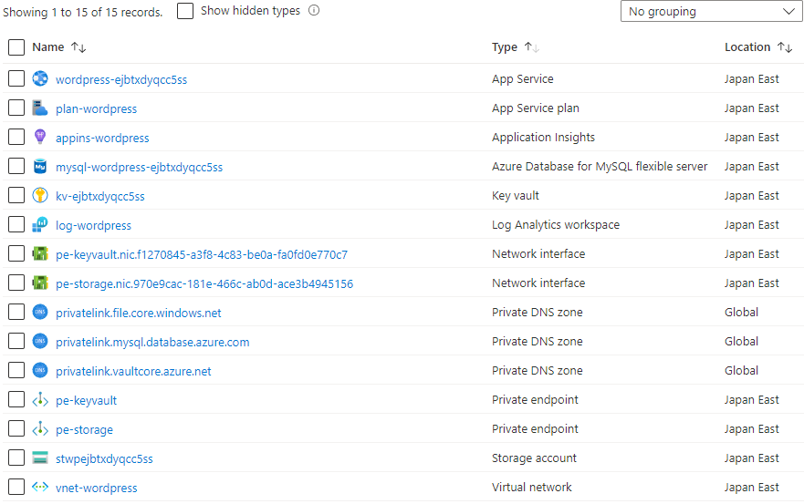
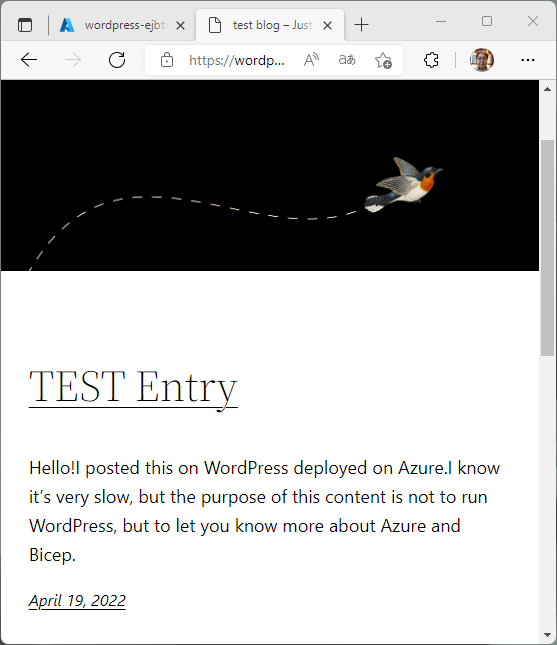

# Low-cost, high-security WordPress environment deployed on Azure

**Select a language: \[[English](./README.md)\] \[[日本語](./README-ja.md)\]**

## feature

- One-shot deployment by Bicep
- High security is ensured by accessing almost all PaaS through the Virtual Network.
- Confidential information is stored in the Key Vault. Secure access from the application via Key Vault Reference (of course, closed).
- WordPress container image is official base.
- Persistent areas are stored in MySQL and Storage


## How to use

az login ready and target subscriptions already selected

```sh
az login --tenant your_tenant_name_or_id
az account set --subscription your_subscription_name_or_id
```

Modify the values of LOCATION, RESOURCE_GROUP, and ADMIN_PASS in deploy.sh as appropriate.

```sh
LOCATION=japaneast
RESOURCE_GROUP=rg-azure-wordpress
ADMIN_PASS='P@ssword'
```

When deploy.sh is executed, a resource group is created and the necessary resources are created under it.

Deployment of Database for MySQL Flexible Server takes about 30 minutes, so wait leisurely.

```sh
$ ./deploy.sh 
+ LOCATION=japaneast
+ RESOURCE_GROUP=rg-azure-wordpress
+ date +deploy-%d%H%M%S
+ DEPLOY_NAME=deploy-19094617
+ ADMIN_PASS=P@ssword
+ az group create --location japaneast --resource-group rg-azure-wordpress
{
  "id": "/subscriptions/..../resourceGroups/rg-azure-wordpress",
  "location": "japaneast",
  "managedBy": null,
  "name": "rg-azure-wordpress",
  "properties": {
    "provisioningState": "Succeeded"
  },
  "tags": null,
  "type": "Microsoft.Resources/resourceGroups"
}
+ az deployment group create --name deploy-19094617 --resource-group rg-azure-wordpress --template-file ./deploy.bicep --parameters adminPass=P@ssword cheapLevel=1
 - Running ..
```

After the deployment is completed, when the command prompt comes back, I take a look from Azure Portal and see that various resources have been created successfully.



Open wordpress-xxxxx (App Service), check the URL and open it from your browser.

On initial launch, it takes time to pull the Docker Container, so it takes a while to display.

If the DB connection fails or the browser times out, reloading the browser or doing a Web Apps Restart may improve the situation.

Once the initial WordPress installation screen appears successfully, all that remains is to actually use it.


It was very slow, but I could confirm that it was working properly.



## About the Bicep Code

- It's not great code by any means.
- For sample purposes, some parts have been skimmed (e.g., references to Subnet IDs in Virtual Network).
- Nevertheless, I followed [Best practices for Bicep](https://docs.microsoft.com/en-us/azure/azure-resource-manager/bicep/best-practices)
- The implementation of Private Endpoint and the use of Key Vault from Web Apps may be helpful.
- As noted on the Best practices page, the use of dependsOn is not a bad thing. We have described only the minimum necessary dependencies for a reason.

## About WordPress Container Images

I wanted to use the one in [WordPress Official Image](https://hub.docker.com/_/wordpress) as it is, but /etc/apache2/apache2.conf was not convenient as it is. container image (katakura/wordpress:latest) is used.

The contents of the Dockerfile can be found in wordpress/ in this repository.

```Dockerfile
FROM wordpress:latest

RUN echo "EnableMMAP Off" >> /etc/apache2/apache2.conf

RUN echo "EnableSendfile Off" >> /etc/apache2/apache2.conf

EXPOSE 80

CMD ["apache2-foreground"]
```

This is from Stack overflow [Wordpress in Containers - getting 502 when loading some images](https://stackoverflow.com/questions/65021932/wordpress-in-containers-getting-502-when-loading-some-images), so I found the same problem in the The response was based on the answers provided.

## About Azure Fees

In April 2022, VNET Integration, Private Endpoint became GA for the App Service Basic SKU as well, allowing for inexpensive configuratiaons.

[Generally available: Enhanced network security features for App Service Basic SKU](https://azure.github.io/AppService/2022/04/14/Enhanced-security-for-basic-sku.html)

Roughly speaking, it will be about $25/month (¥3,000/month) without taking network traffic into account.

## Performance

If you want to implement a full-scale WordPress environment, you need to raise each plan. Unfortunately, the storage to be mounted from the App Service is a CIFS connection, so you cannot expect much higher speed with this configuration.

Hopefully mount by NFS will be implemented in the future.
